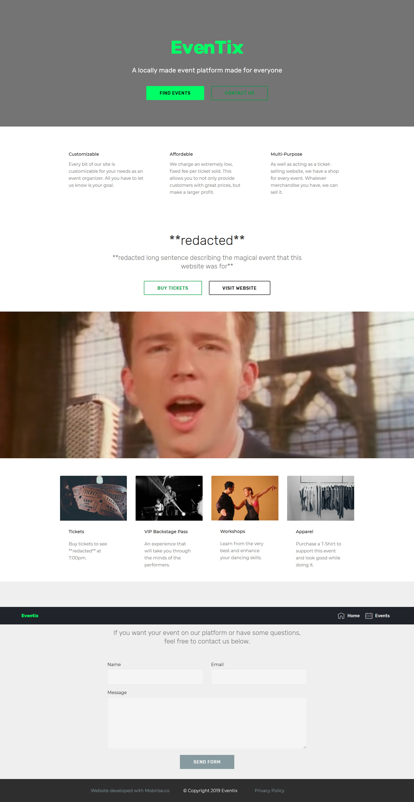
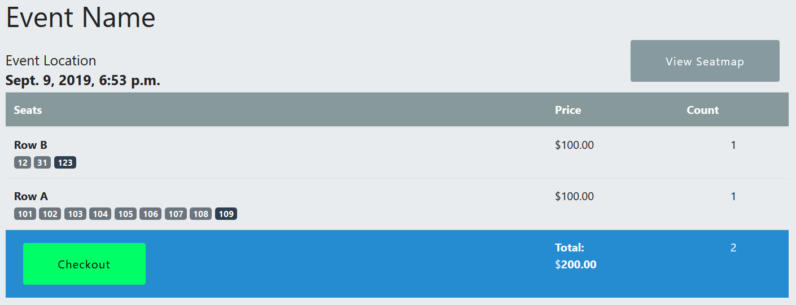

## Eventix Website
This respository has quite poor code. Please do **NOT** copy it. However, feel free to use it for inspiration or just as an example of not-so-great code. The website should still be functional if you follow the instructions below the image.

### Ticket selection page

### Installation
 * Install [python](https://www.python.org) and [pip](https://pip.pypa.io/en/stable/installing/)
 * Install virtualenv with `pip install virtualenv`
 * Clone the repository with `git clone https://github.com/TheAvidDev/eventix-site/`
 * Create a virtualenv somewhere (usually one folder up or within) with `virtualenv [env-name]`
 * Activate the virtualenv depending on OS: [Windows](https://programwithus.com/learn-to-code/Pip-and-virtualenv-on-Windows/) or [Linux](https://linuxhint.com/python-virtualenv-tutorial/)
   * You can exit the virtualenv with `deactivate`
 * Download the requirements with `pip install -r requirements.txt`
 * Make migrations and migrate the database with `python manage.py makemigrations` and `python manage.py migrate`
 * Run the server with `python manage.py runserver`
 * Visit the website `127.0.0.1:8000` and take a look
 * Modify the `SECRET_KEY`, `STRIPE_SECRET_KEY`, and `STRIPE_PUBLISHABLE_KEY` in the `djangostripe/settings.py` file
 
 
 ## Good luck! You're on your own now. Take a look at the [django docs](https://docs.djangoproject.com) if something doesn't work.
 
